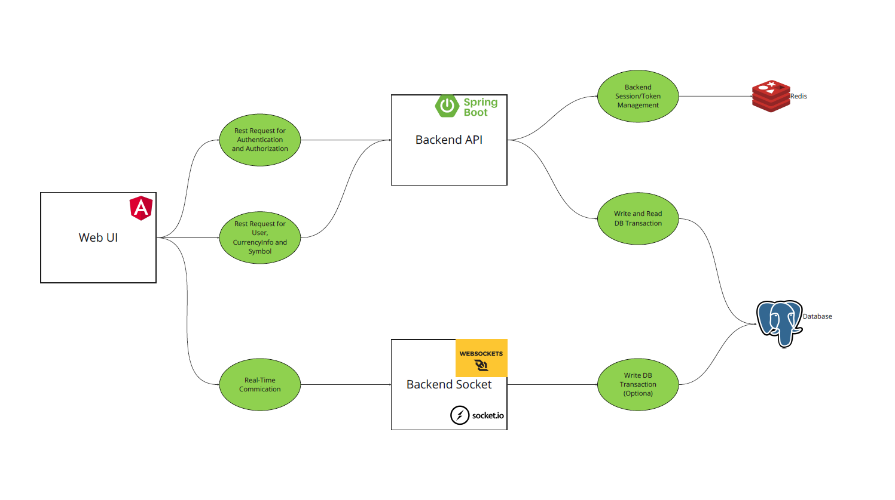

# Uygulama Adı: Realtime App

## Kullanılan Teknolojiler

- **Frontend:**
  - Angular.js
  - Angular Material
  - Syncfusion
  - Ag-Grid
  - Socket.io(Client)

- **Backend:**
  - Springboot
  - Node.js
  - Socket.io(Server)

- **Diğer:**
  - Postgres
  - Redis
  - Kafka
  - Liquibase(DB Migration ve versiyonlama)
  - Smtp
  - Docker

## E2E Mimari



## Nasıl Çalıştırılır

### Gereksinimler

- Docker yüklü olması en basit hali ile çalışırılması için yeterlidir. 
- Diğer bir yöntem ise yukarda belirtilen tüm teknolojilerin ayrı ayrı kurulmasıdır.

### Docker ile Çalıştırma

### Birinci Yöntem

#### Adım 1: Repository klonlayın
```sh
git clone https://github.com/BurakCalisgan/Realtime-App.git
cd Realtime-App
```

#### Adım 2: Docker Compose komutu ile uygulamayı başlatın
```sh
docker compose up -d
```

#### Adım 3: Çalışan uygulamaları kontrol edin
```
Backend Api    : http://localhost:8383/swagger-ui/index.html
Backend Socket : http://localhost:3000
Frontend       : http://localhost:4200
```

### İkinci Yöntem

#### Adım 1: Repository klonlayın
```sh
git clone https://github.com/BurakCalisgan/Realtime-App.git
cd Realtime-App
```

#### Adım 2: Docker Compose komutu ile local compose dosyasını çalıştırın
```sh
## Kafka, redis, postgres image kurulumu için.
docker-compose -f docker-compose-local.yaml up -d
```

#### Adım 2: Uygulamaların dizinlerine giderek projelerin açılması ve run edilmesi

#### Adım 3: Çalışan uygulamaları kontrol edin
```
Backend Api    : http://localhost:8383/swagger-ui/index.html
Backend Socket : http://localhost:3000
Frontend       : http://localhost:4200
```
